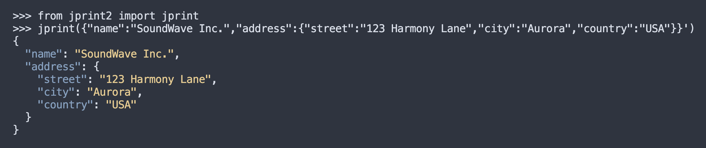

# jprint2

A drop-in replacement for `print` that formats output as JSON using [jsons](https://github.com/ramonhagenaars/jsons) and colorizes it with [pygments](https://pygments.org/).



## Usage

```python

# - Print json

from jprint2 import jprint

jprint("a", "b", "c")
# [
#   "a",
#   "b",
#   "c"
# ]

jprint({"name": "Mark", "mood": 10})
# {
#   "name": "Mark",
#   "mood": 10 
# }

jprint("Mark") # Mark

jprint('{"name": "Mark"}')
# {
#   "name": "Mark"
# }

# - Replace print with jprint

import jprint2.replace_print_with_jprint
# ... your script

print("Hello", "friend!")
# [
#   "Hello",
#   "friend!"
# ]


```

## License

MIT License

## Author

Mark Lidenberg [marklidenberg@gmail.com](mailto:marklidenberg@gmail.com)